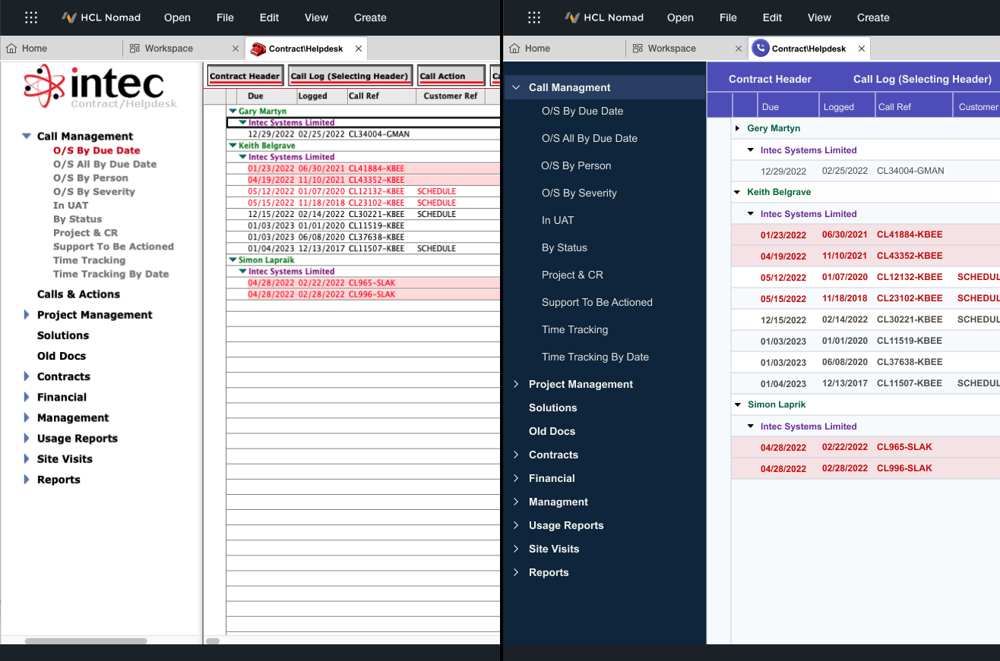

# Demo server – HCL Domino

## The goal

The purpose of this demo server is to test the latest _HCL Domino V12_ features.

## Deployed software, configured services
- HCL Domino 12.0.2
- HCL Verse 3.0
- HCL Traveler 12.0.2
- HCL Nomad for Web Browsers 1.0.6

## Access

### Server
Server hostname: **domino.showcase.blue**

The demo server provides the following services:

| Name | Description | URL |
|------|-------------|-----|
| Web | Basic web access | https://domino.showcase.blue |
| Verse | Domino web mail | https://domino.showcase.blue/verse |
| Traveler | Domino mobile mail | https://domino.showcase.blue/traveler |
| Nomad | Web access to Domino apps | https://domino.showcase.blue:9443 |

### Users
User accounts are crated manualy, by the server administrator. \
Each user is notified via email and received personal credentials: user name and password.

> The credentials are unique, please do nto share it with others.

## Examples

Example screenshots of the services running on the demo server.
> Note: the content could be different.

**Web access** - custom login screen

**Verse** - web and mobile clients

**Nomad** - web and mobile clients

**Restyle** - modernize design of old Domino apps

## Contact
**System administrator** \
Petr Kunc \
petr.kunc@hcl.com

